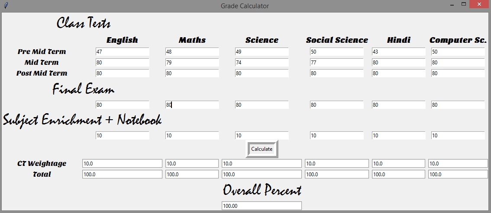
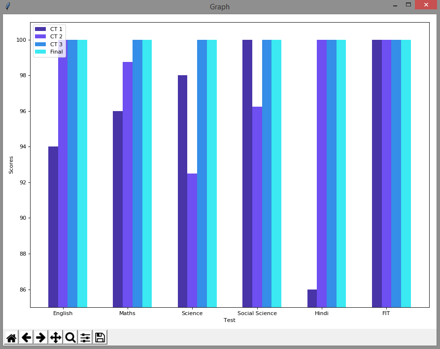

# Grade-Calculator

A marks Calculator.

> **Note:** This has two windows... one made with tkinter and the other with matplotlib. The second window will be shown only after you press the ```Calculate``` button or press <kbd>Enter</kbd> .

<div align="center">&#x1F34E;&#x1F34F;&#x1F34E;&#x1F34F;&#x1F34E;&#x1F34F;&#x1F34E;&#x1F34F;</div>

## 1.The opening window...



## 2.The graph window...


<div align="center">&#x1F4D7;&#x1F4D8;&#x1F4D9;</div>

#### Note: You need to install these poeple...
```python
from tkinter import *
import math
import heapq
import numpy as np
import matplotlib.pyplot as plt
from matplotlib import style
```
<div align="center">&#x1F4D7;&#x1F4D8;&#x1F4D9;</div>
<div align="center">&#x1F34E;&#x1F34F;&#x1F34E;&#x1F34F;&#x1F34E;&#x1F34F;&#x1F34E;&#x1F34F;</div>
